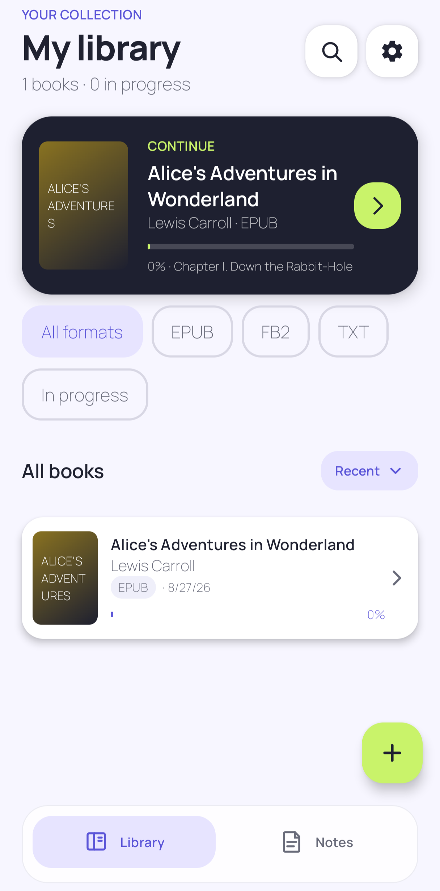
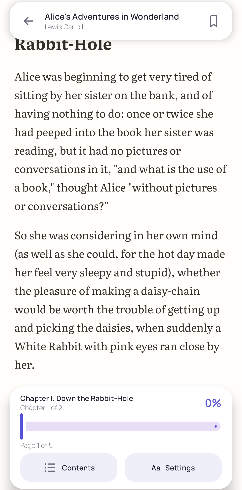
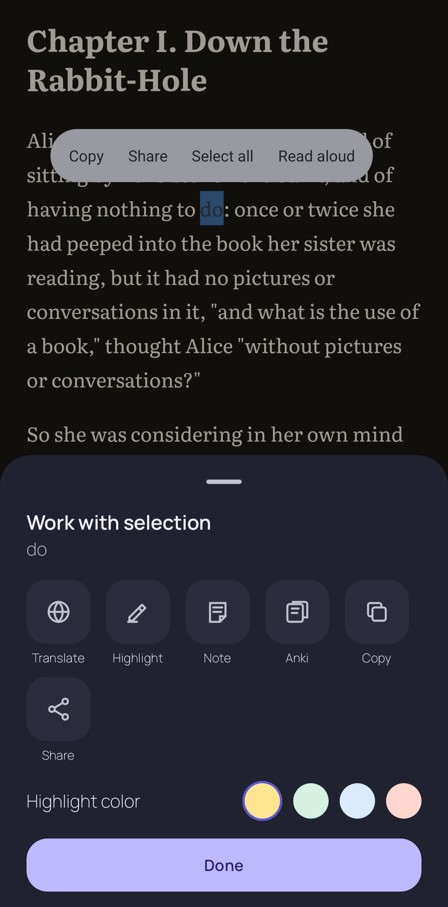
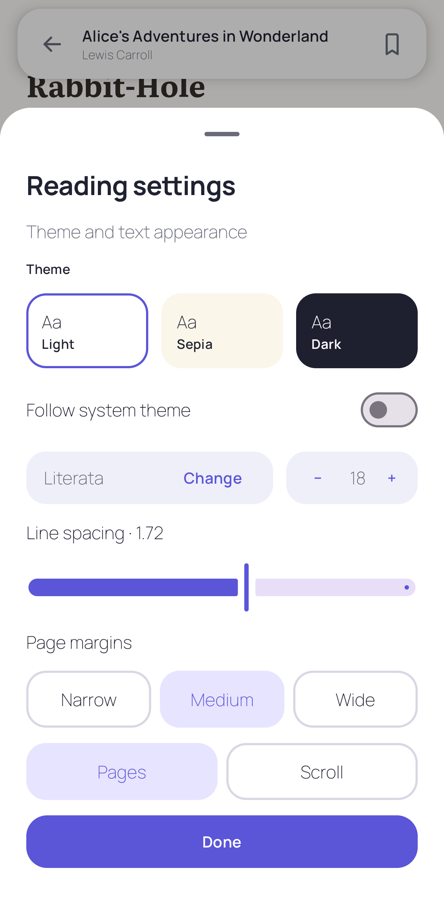

<div align="center">

# ReadBound


EPUB · FB2 · TXT — with highlights, notes, dictionaries, AI translation, Anki cards and WebDAV sync.

[](https://www.android.com)
[](https://developer.android.com/about/versions/oreo)
[](https://developer.android.com)
[](https://kotlinlang.org)
[](https://developer.android.com/jetpack/compose)
[](https://readium.org)







</div>

---

## Features

### Reading
- **EPUB, FB2 and TXT** import (FB2 is converted on the fly), powered by the [Readium Kotlin toolkit](https://github.com/readium/kotlin-toolkit)
- Paged and scrolling reading modes with precise position restore
- Light/dark themes, app theme choice, adaptive bottom navigation / navigation rail
- Sanitized offline rendering: remote subresources are blocked in the reading WebView
- Open books directly from other apps (`VIEW` intent for EPUB/FB2/TXT)

### Annotations & learning
- Highlights, notes, tags and bookmarks — all stored locally in Room
- **Dictionaries**: import dictionaries as separate ZIP files, indexed locally; enable, disable or remove them independently. Nothing is bundled in the APK

> **Where to get dictionaries?**
Any Yomitan-compatible ZIP works — a large curated collection (frequency lists, monolingual and bilingual dictionaries) lives at [MarvNC/yomitan-dictionaries](https://github.com/MarvNC/yomitan-dictionaries).

- **AI translation** of selected text via any OpenAI-compatible Chat Completions endpoint. API keys are encrypted at rest with Android Keystore; a backend proxy is recommended for distributed builds
- **AnkiDroid export**: turn a selection into a flashcard in one tap, with a configurable card builder (prefilled translations, custom fields)

### Data & sync
- **Local backup** — portable archive of library metadata and annotations
- **WebDAV sync** — metadata and annotations only; book files and secrets are never uploaded. After restoring on another device, tap a book and pick the matching local file
- WebDAV password protected by Android Keystore

### Plugins
- Sandboxed JavaScript plugins run in an **isolated Android process** on QuickJS with a 2.5 s execution limit
- Manifest-declared capabilities (`network`, `anki.write`), host allow-list, ZIP-traversal checks, 5 MB size limit
- See [plugin-sdk/README.md](plugin-sdk/README.md) for the contract and [samples/dictionary-plugin](samples/dictionary-plugin) for a working example

## Deliberate scope

PDF, MOBI, DjVu, DRM, OPDS, online catalogs and TTS are intentionally **not** part of this version. Small surface, well-tested core.

## Tech stack

| Layer | Choice |
| --- | --- |
| Language | Kotlin 2.3 |
| UI | Jetpack Compose (BOM 2026.06) + Material 3 |
| EPUB/FB2 rendering | Readium Kotlin toolkit 3.3 |
| Persistence | Room 2.8, DataStore |
| Background work | WorkManager |
| JS plugins | quickjs-kt in an isolated process |
| Images | Coil 3 |
| Security | Android Keystore, network security config |


## Building from source

**Requirements:** JDK 17+ and Android SDK 36.

```powershell
# Debug build
.\gradlew.bat :app:assembleDebug

# Unit tests
.\gradlew.bat :app:testDebugUnitTest
```

The debug APK is written to `app/build/outputs/apk/debug/app-debug.apk`.


## Privacy & security

- No accounts, no analytics, no ads, no third-party trackers
- Books and annotations stay in private app storage
- API keys and the WebDAV password are encrypted via Android Keystore
- Imported publications are sanitized; remote subresources are blocked while reading
- Plugins declare capabilities up front and run isolated and time-limited

## License

This project is distributed under the terms of the license in the [LICENSE](LICENSE) file.
